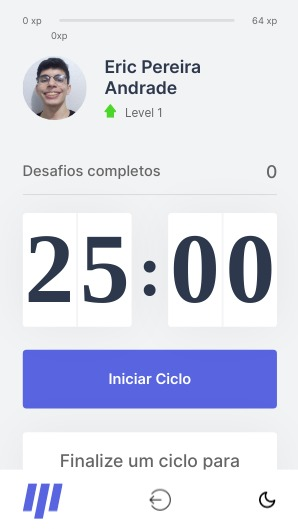
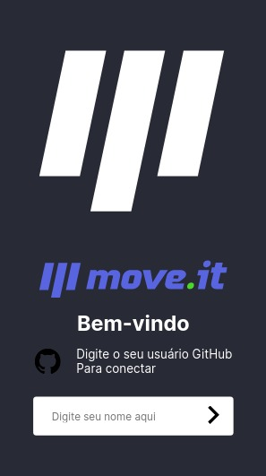

<link rel="preconnect" href="https://fonts.googleapis.com">
<link rel="preconnect" href="https://fonts.gstatic.com" crossorigin>
<link href="https://fonts.googleapis.com/css2?family=Poppins:wght@700&display=swap" rel="stylesheet">

# Pomodoro Timer with some Exercises

<span style="font-family: 'Poppins', sans-serif;font-size:9pt">
Creation of a timer pomodoro with some exercises to de-stress a little, and take the stress out of activities, thus making the activity more productive. Project developed at NLW 4 with some specific additions in the application.
</span>

<br/>
<br/>

## Demo

<span style="font-family: 'Poppins', sans-serif;font-size:9pt">

You can follow the site through the Link: https://moveit-ericpandrade.vercel.app/

</span>

<br/>

## Installation

<span style="font-family: 'Poppins', sans-serif;font-size:9pt">
Install my-project with npm
</span>

```bash
  npm install my-project
  cd my-project
```

## Run Locally

<span style="font-family: 'Poppins', sans-serif;font-size:9pt">
Clone the project
</span>

```bash
  git clone https://link-to-project
```

<span style="font-family: 'Poppins', sans-serif;font-size:9pt">
Go to the project directory
</span>

```bash
  cd my-project
```

<span style="font-family: 'Poppins', sans-serif;font-size:9pt">
Install dependencies
</span>

```bash
  npm install
```

<span style="font-family: 'Poppins', sans-serif;font-size:9pt">
Start the server
</span>

```bash
  npm run start
```

<br/>
<br/>

<div>
  <span style="font-family: 'Poppins', sans-serif;font-size:16pt">

 NLW Challenges
</span>

  <p style="font-family: 'Poppins', sans-serif;font-size:10pt">
  Responsivity
  </p>

  <p style="font-family: 'Poppins', sans-serif;font-size:10pt">
  Dark Theme
  </p>

  <p style="font-family: 'Poppins', sans-serif;font-size:10pt">
  Login
  </p>

  <p style="font-family: 'Poppins', sans-serif;font-size:10pt">
  GitHub Api Login
  </p>
</div>

<br/>

 <span style="font-family: 'Poppins', sans-serif;font-size:20pt"> Designs<span>

<br/>

### **Desktop**

<br />

<p style="font-family: 'Poppins', sans-serif;font-size:10pt">
Home Desktop Light
</p>


<p style="font-family: 'Poppins', sans-serif;font-size:10pt">
Home Desktop Dark
</p>


<p style="font-family: 'Poppins', sans-serif;font-size:10pt">
Login Desktop Light
</p>


<p style="font-family: 'Poppins', sans-serif;font-size:10pt">
Login Desktop Dark
</p>


<br/>

### **Mobile**

<br />

<p style="font-family: 'Poppins', sans-serif;font-size:10pt">
Home Mobile Light
</p>



<p style="font-family: 'Poppins', sans-serif;font-size:10pt">
Home Mobile Dark
</p>


<p style="font-family: 'Poppins', sans-serif;font-size:10pt">
Login Mobile Light
</p>


<p style="font-family: 'Poppins', sans-serif;font-size:10pt">
Login Mobile Dark
</p>



<br/>
<br/>

## Contact

<div> 
  
  <a href = "mailto:ericpandrade085@gmail.com"></a>
  <a href="https://www.linkedin.com/in/eric-pereira-andrade-872a01210/" target="_blank"></a> 
  <a href="https://api.whatsapp.com/send?phone=+5585989828188&text=Olá! Gostaria de entrar em contato." target="_blank"></a>

</div>

<span style="font-family: 'Poppins', sans-serif;font-size:9pt; font-style:italic">
Project made by Eric Pereira Andrade.
</span>
